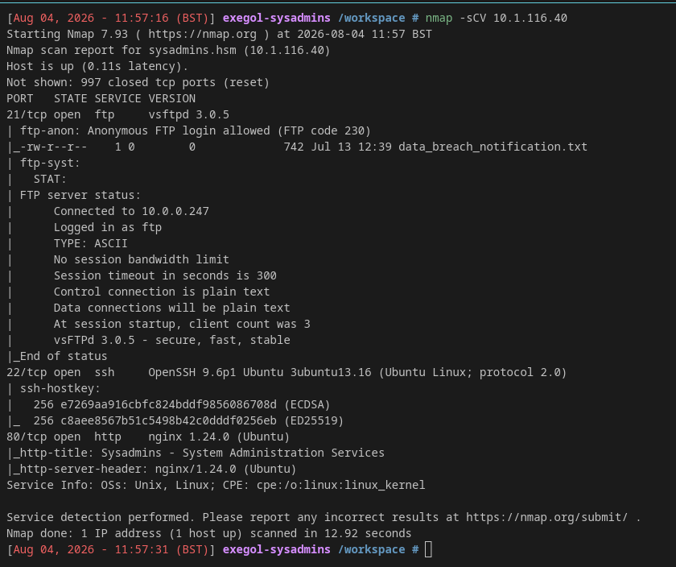
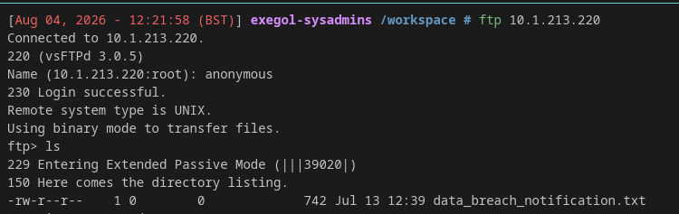
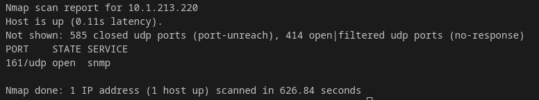
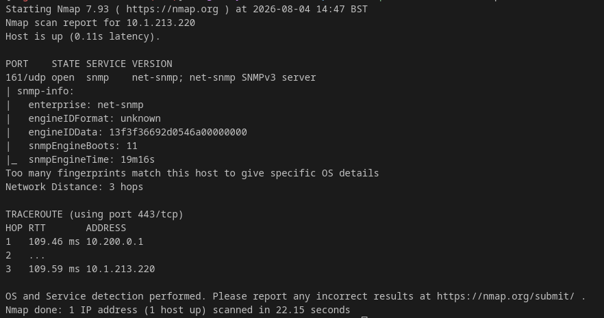
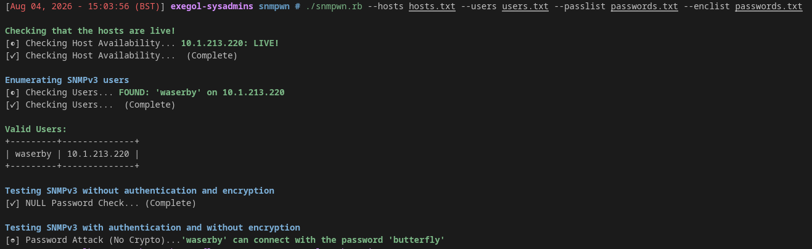
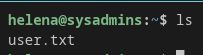
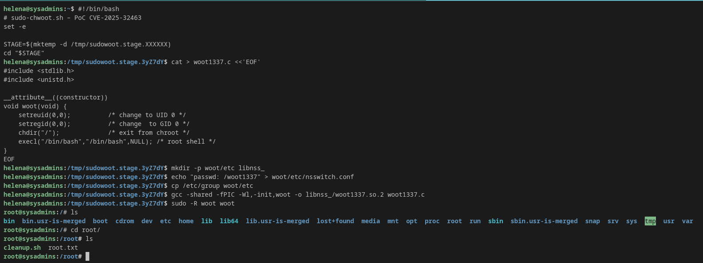

+++
title = "HSM - Sysadmins"
date = 2026-08-04T11:47:47+01:00
draft = true
toc = true
tags = ["linux", "privesc"]        
categories = ["writeups"]

[params]
  difficulty = "medium"                 
+++

## Challenge

You have been hired to perform a penetration test against a sensitive Linux server in the client's internal network. Your task is to thoroughly enumerate the machine, identify all vulnerabilities, and (if possible) elevate your privileges to root to demonstrate impact.
Initial Access

The client has provided you with VPN access but no other information.

## Recon

### FTP - Port 21
Starting with the initial scan:
```nmap -sCV TARGET_IP``` 

Port 21 reveals ftp-anon which allows for anonymous login into the ftp server

logging into ftp gives you the the below information


This reveals a file which after transferring to the host machine reveals a potential username of "peter" and a pastebin link which contains the mentioned breached password list. 

### HTTP - port 80

Browsing the website there is a few pages present but nothing that jumps out as vulnerable. However, there is a meet the team page with the names waserby, helena and peter giving a list of potential usernames that can be logged in as.

### SSH - port 22

I attempted to use the usernames and password lists to login using ssh but there was no valid credentials found. 

### UDP Scan

After struggling for awhile a hint from Tyler Ramsbey directed me to run a UDP scan against the target IP:

```nmap -sU 10.1.213.220 -T5```
This scan reveals port 161 running snmp a service ive never seen before, so had to go do some research on it. 


After running this I then ran:
```nmap -sU 10.1.213.220 -p 161 -A -T5```
To reveal SNMPv3 running on the server

## Exploitation

### Initial Access
After some research and some help from a friend I found the tool [snmpwn](https://github.com/hatlord/snmpwn) which is intended for snmpv3 aswell.

To use the tool I ran the command:

```./snmpwn.rb --hosts hosts.txt --users users.txt --passlist passwords.txt --enclist passwords.txt```

Running this command reveals alot of information we can use and also provides us with a POC to explout the SNMP vulnerability.


then running the command: 

```snmpwalk -u waserby -A butterfly 10.1.213.220 -v3 -l authnopriv``` 

Outputs a big block of text which we save to a file, but one line sticks out, grepping for ssh gives us inital access credentials giving us Initial user access to the system and the user flag. 

 

### Privilege Escalation

After gaining initial access to the system I try running sudo -l on the system to see what the user is allowed to run. However the user helena is not allowed to run sudoers on sysadmins. The next thing I check is the sudo version which is identified as Sudo version 1.9.16p2. Googling the sudo version identifies [CVE‑2025‑32463](https://www.exploit-db.com/exploits/52352) which has a pretty easy exploit to follow and gives root access.


#